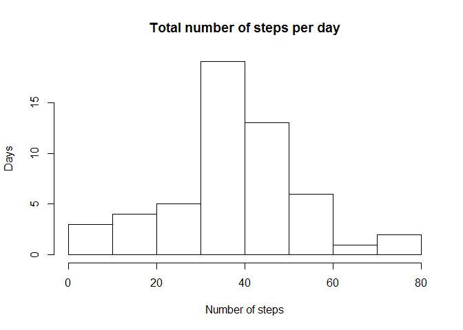

# Reproducible Research: Peer Assessment 1


## Loading and preprocessing the data
First loading nd processing the data. 

```r
mdata <- read.csv("activity.csv", header=TRUE)
```
## What is mean total number of steps taken per day?

```r
data <- aggregate(steps~date, data=mdata, sum)
data$date <- as.Date(data$date,"%Y-%m-%d")
hist(data$steps, main="Total number of steps per day", xlab="Number of steps", ylab="Days")
```

 

```r
summary(data)
```

```
##       date                steps      
##  Min.   :2012-10-02   Min.   :   41  
##  1st Qu.:2012-10-16   1st Qu.: 8841  
##  Median :2012-10-29   Median :10765  
##  Mean   :2012-10-30   Mean   :10766  
##  3rd Qu.:2012-11-16   3rd Qu.:13294  
##  Max.   :2012-11-29   Max.   :21194
```
The min and median of total number of steps per day are  
min: 

```
## [1] 41
```
steps  
median : ```median(data$steps)``` steps  

## What is the average daily activity pattern?


## Imputing missing values


## Are there differences in activity patterns between weekdays and weekends?
