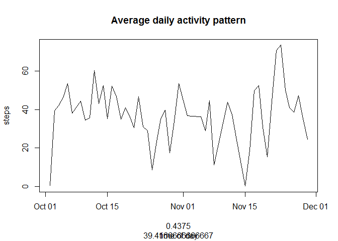
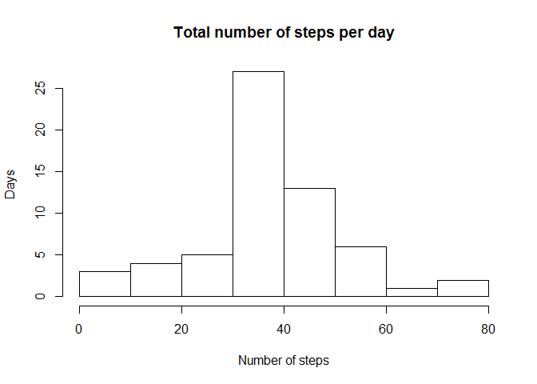

# Reproducible Research: Peer Assessment 1


## Loading and preprocessing the data
First loading nd processing the data. 

```r
mdata <- read.csv("activity.csv", header=TRUE)
mdata$date <- as.Date(mdata$date,"%Y-%m-%d")
```
## What is mean total number of steps taken per day?

```r
data <- aggregate(steps~date, data=mdata, mean)
hist(data$steps, main="Total number of steps per day", xlab="Number of steps", ylab="Days")
```

 
  
The min and median of total number of steps per day are  

```r
summary(data)
```

```
##       date                steps        
##  Min.   :2012-10-02   Min.   : 0.1424  
##  1st Qu.:2012-10-16   1st Qu.:30.6979  
##  Median :2012-10-29   Median :37.3785  
##  Mean   :2012-10-30   Mean   :37.3826  
##  3rd Qu.:2012-11-16   3rd Qu.:46.1597  
##  Max.   :2012-11-29   Max.   :73.5903
```
  
## What is the average daily activity pattern?

```r
mdata$interval <- (format(mdata$interval, width=4))
mdata$interval <- chartr(" ", "0", mdata$interval)
mdata$interval <- as.numeric(mdata$interval)
data <- aggregate(steps~date, data=mdata, mean)
```
  
plot the data

```r
plot(data, data$steps, type="l", main="Average daily activity pattern", sub="time of day")
```

 
The interval containing the highest steps is

```r
data[which.max(data$steps),]
```

```
##          date    steps
## 47 2012-11-23 73.59028
```
  
## Imputing missing values
Find out how many records with missing value

```r
missing <- mdata[is.na(mdata$steps),]
nrow(missing)
```

```
## [1] 2304
```
  
fill the missing value

```r
for (i in 1:length(mdata$steps)) { 
if (is.na(mdata[i,1])) {mdata[i,1] <- 37.3785}
}
```
  
Create a new dataset with the missing data filled in

```r
data <- aggregate(steps~date, data=mdata, mean)
hist(data$steps, main="Total number of steps per day", xlab="Number of steps", ylab="Days")
```

 
  
The min and median of total number of steps per day are  

```r
summary(data)
```

```
##       date                steps        
##  Min.   :2012-10-01   Min.   : 0.1424  
##  1st Qu.:2012-10-16   1st Qu.:34.0938  
##  Median :2012-10-31   Median :37.3785  
##  Mean   :2012-10-31   Mean   :37.3821  
##  3rd Qu.:2012-11-15   3rd Qu.:44.4826  
##  Max.   :2012-11-30   Max.   :73.5903
```
  
Comparing with the first assignemtn there is slightly change in mean value due to added day period, the filling missing value using median doesn't impact the estimates of the total daily number of steps. 

## Are there differences in activity patterns between weekdays and weekends?
identify the day of data

```r
library(plyr)
for (i in 1:length(mdata$steps)) { 
if (is.na(mdata[i,1])) {mdata[i,1] <- 37.3785}
}
mdata$date <- as.Date(mdata$date,"%Y-%m-%d")
mdata <- mutate(mdata, days=weekdays(mdata$date))
head(mdata)
```

```
##     steps       date interval   days
## 1 37.3785 2012-10-01        0 Monday
## 2 37.3785 2012-10-01        5 Monday
## 3 37.3785 2012-10-01       10 Monday
## 4 37.3785 2012-10-01       15 Monday
## 5 37.3785 2012-10-01       20 Monday
## 6 37.3785 2012-10-01       25 Monday
```
  
plot the data

```r
data <- aggregate(steps~date, data=mdata, mean)
```
